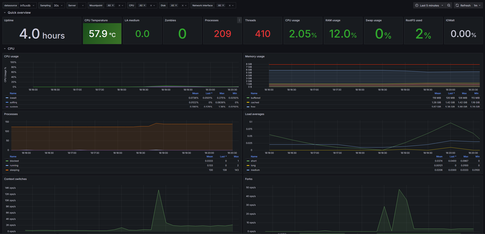

# Raspberry Pi Metrics Monitoring Setup

This repository provides a setup script to streamline the installation and configuration of a monitoring stack for collecting and visualizing system metrics from a Raspberry Pi. The script supports two primary setups:

- **Agent Setup**: Installs the Telegraf agent to collect OS metrics and send them to a remote server.
- **Server Setup**: Installs and configures the monitoring stack (*Grafana, InfluxDB, and Telegraf*) to collect, store, and visualize OS metrics locally.

## Usage Instructions

### 1. Clone the Repository

```bash
git clone https://github.com/bruno-espino/pi-monitoring-stack.git
cd pi-monitoring-stack
```

### 2. Set Up Environment Variables:

Open ```config/variables.sh``` and update the dummy values.

### 3. Run the Setup Script: 
Execute the main setup script and choose Agent or Server setup:
```bash
./setup.sh
```


Once the setup is complete, you can access a pre-configured Grafana dashboard for Raspberry Pi monitoring. This dashboard provides visual insights into key system metrics such as CPU usage, memory utilization, disk space, and more.


Communtiy dashboard can be found at: https://grafana.com/grafana/dashboards/10578-raspberry-pi-monitoring/